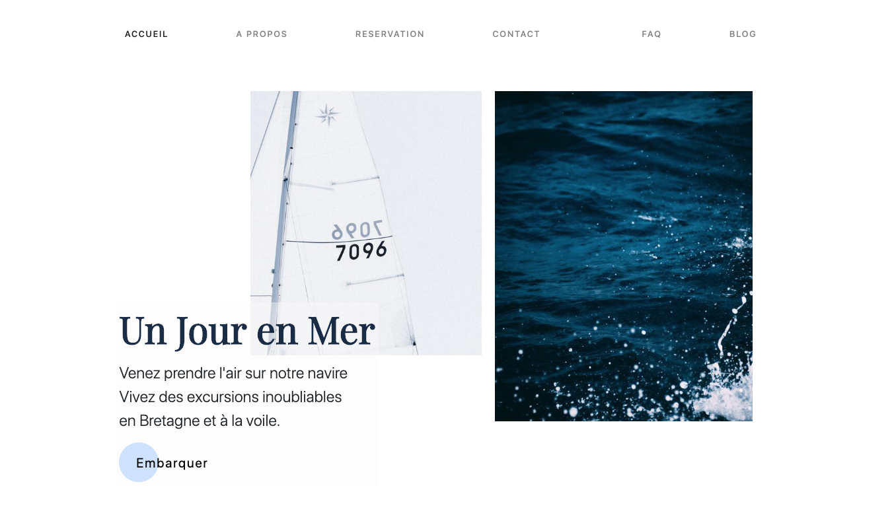

# un-jour-en-mer - Projet Front Fictif - Entreprise d'excursion maritime - Responsive Mobile - Vue 3 w/VueCli, VueRouter, Gsap Anim, Gsap ScrollTrigger, Bootstrap.

<p>Homepage Screenshot</p>


<p>Dernières améliorations V0.1.1 </p>
<ul>
    <li>Dark Mode w/local storage & animation</li>     
    <li>Custom 404 Page w/video</></li>
    <li>Implémentation d'un slider présentation des voiliers avec Swiper.js</li>
    <li>Effets transitions entre les pages</li> 
</ul>

<p>Perspectives d'amélioration:</p>
<ul>
    <li>Blog: Création des pages articles / single article</li> 
    <li>Amélioration SEO / Metadonnées</li> 
</ul>


## Project setup
```
npm install
```

### Compiles and hot-reloads for development
```
npm run serve
```

### Compiles and minifies for production
```
npm run build
```

### Lints and fixes files
```
npm run lint
```

### Customize configuration
See [Configuration Reference](https://cli.vuejs.org/config/).
